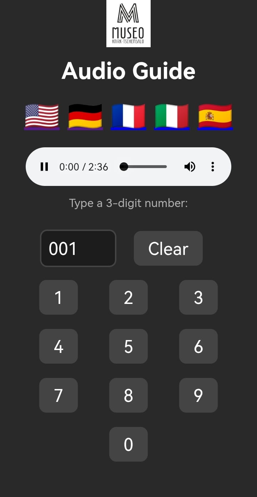

## 📄 Simple HTML Audioguide

#### 🎧 Overview

This is a lightweight, multilingual HTML-based audioguide system for museums, exhibitions, or educational spaces. Visitors can enter a three-digit number on a web interface to play the corresponding audio file in their selected language.

---

#### 🌐 Features

* Fully browser-based – no backend or database required
* Language selection via emoji flags (🇩🇪 🇬🇧 🇫🇷 🇮🇹 🇪🇸)
* Numeric keypad for simple code entry (e.g., 001, 002, 003)
* Plays local `.mp3` files based on 3-digit user input
* Works offline (can be used as a kiosk or on local devices)

---

#### 📁 Folder Structure

```
Audioguide/
│
├── index.html                # Redirects to default language (e.g., German)
├── style.css                 # Optional styling
├── logomuseo.jpeg            # Logo shown on all pages
│
├── de/                       # German audioguide files
│   ├── Audioguide.html
│   ├── 001.mp3
│   ├── 002.mp3
│   └── 003.mp3
│
├── en/                       # English version (structure same as 'de')
│   └── Audioguide.html
│   ├── 001.mp3
│   ├── 002.mp3
│   └── 003.mp3
│
├── fr/, it/, es/             # Other languages
```

---

#### 🛠 How It Works

1. The user selects a language via a flag button.
2. The corresponding `Audioguide.html` file is opened.
3. The user enters a 3-digit code using the on-screen number buttons
4. If a matching `.mp3` file exists (e.g., `001.mp3`), it will be played.
5. Input is automatically cleared after 1 second to simplify further use.

---

#### 🔤 Adding More Languages

To add a new language:

1. Duplicate one of the existing language folders (e.g., `de`).
2. Translate the interface texts in the new `Audioguide.html`.
3. Add corresponding `.mp3` files (same filenames: `001.mp3`, etc.).
4. Update the flag section to include a new language link.

---


#### 📷 Screenshot
<table>
  <tr>
    <td align="center" width="50%">
      <br>
      <strong>Audioguide Interface (Android/Chrome)</strong>
    </td>
  </tr>
</table>

#### 💡 Customization Ideas

* Include images or descriptions for each code
* Play preview sounds on hover for accessibility
* Add styling via `style.css` for responsive design

---


## 📄 License

This project is licensed under the GNU General Public License v3.0 (GPL-3.0).  
You are free to use, modify, and distribute it — as long as you share your changes under the same license.

### 🚶 Credits

Originally developed for **Phantomcrew**'s corporate identity needs, now open for your adaptation.

### 🤝 Author

Made with ❤️ by Julius – [phantomcrew.de](https://phantomcrew.de/)
